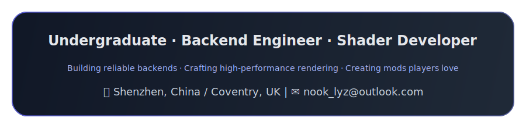
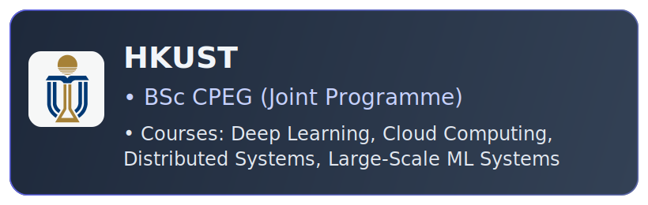
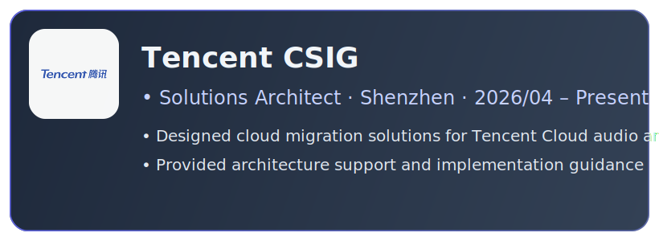
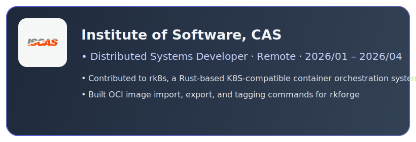
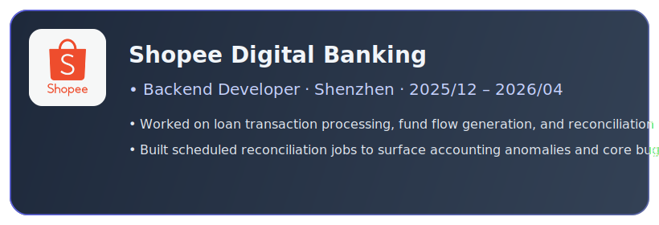
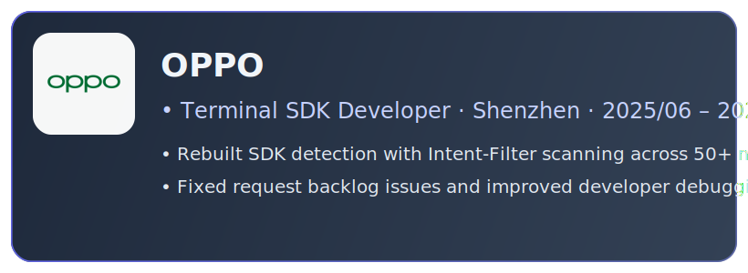
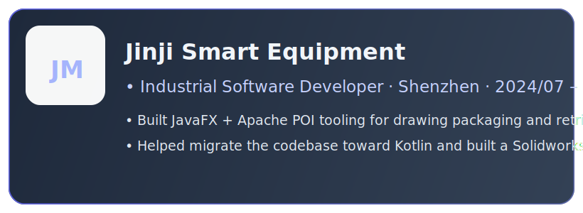

<!-- 🌐 Language Switch -->

  <a href="./README.md">English</a> | <a href="./README_CN.md">简体中文</a>

<!-- ═══════════════════════════════════════════════════ -->
<!-- HERO -->
<!-- ═══════════════════════════════════════════════════ -->

<h1>✦ Yuanzhi Liu ✦</h1>

 

<!-- Quick Links -->

&nbsp;

<!-- ═══════════════════════════════════════════════════ -->
<!-- Education Cards -->
<!-- ═══════════════════════════════════════════════════ -->

<h2 align="center">🎓 Education</h2>

<table>
  <tr>
    <td align="center" valign="top" width="50%">
      
    </td>
    <td align="center" valign="top" width="50%">
      
    </td>
  </tr>
</table>

<!-- ═══════════════════════════════════════════════════ -->
<!-- Work Experience -->
<!-- ═══════════════════════════════════════════════════ -->

## 💼 Work Experience

  
    
  
    
  
    
  
    
  

<!-- ═══════════════════════════════════════════════════ -->
<!-- Featured Projects -->
<!-- ═══════════════════════════════════════════════════ -->

## 🚀 Mod Projects

<table>
<tr>
<td width="50%" valign="top">

### Dynamic Shader

> A custom HLSL shader bringing **HD2D-style** rendering to Stardew Valley.

- Intercepts game render pipeline via **Harmony** to inject custom shaders simulating a 3D lighting system
- **GPU-accelerated** shadow rendering + double-buffered shadow collection queues for low-overhead global shadows. LUT saves 15M math ops; separable convolution kernel optimises Gaussian blur; dual-dict texture classification cuts 90% draw calls
- **Custom vertex/pixel shaders**: 3D projection simulation, contact-hardening shadows, ambient hue shift, tilt-shift effect

`HLSL` `GPU Batching` `Harmony` `Shader`

</td>
<td width="50%" valign="top">

### BetterBuildingUpgrades

> A Stardew Valley mod extending core game methods using Harmony + SMAPI.

- Rewrites and extends core game methods via **reflection injection**
- Resolves **multiplayer data consistency** issues
- Optimises computation overhead for large-scale automation logic, ensuring stable frame rates

`C#` `SMAPI` `Harmony`

</td>
</tr>
</table>

 

<!-- ═══════════════════════════════════════════════════ -->
<!-- Tech Stack -->
<!-- ═══════════════════════════════════════════════════ -->

## 🛠️ Tech Stack

**Work & Production**

**Personal Projects**

**Exploring**

> Other skills: `HLSL` `JavaFX` `LangGraph` `MCP`

 

<!-- ═══════════════════════════════════════════════════ -->
<!-- Community & Activities -->
<!-- ═══════════════════════════════════════════════════ -->

## 📜 Other Activities

- 🎮 Tencent IEG "Opening Lesson" — Game Client (UE) Track Certificate
- 🌐 Contributed Chinese translations for indie games *Big Ambitions* and *Supermarket Simulator* via Localizor
- ✍️ Published mod development articles on Xiaoheihe with **61,900+** total reads
- 🌿 Volunteered at Warwick Nature Conservation for **30+ hours** of environmental work

 

<!-- ═══════════════════════════════════════════════════ -->
<!-- GitHub Stats -->
<!-- ═══════════════════════════════════════════════════ -->

<h2 align="center">📊 GitHub Stats</h2>

&nbsp;

<!-- Trophies -->

<!-- Activity Graph -->

 

<!-- Profile Views -->

