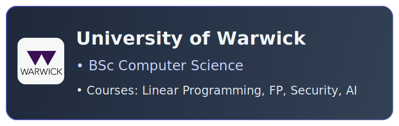

<!-- 🌐 Language Switch -->

  <a href="./README.md">English</a> | <a href="./README_CN.md">简体中文</a>

<!-- ═══════════════════════════════════════════════════ -->
<!-- HERO -->
<!-- ═══════════════════════════════════════════════════ -->

<h1>✦ Yuanzhi Liu ✦</h1>

 

<!-- Quick Links -->

&nbsp;

<!-- ═══════════════════════════════════════════════════ -->
<!-- Education Cards -->
<!-- ═══════════════════════════════════════════════════ -->

<h2 align="center">🎓 Education</h2>

<table>
  <tr>
    <td align="center" valign="top" width="50%">
      
    </td>
    <td align="center" valign="top" width="50%">
      
    </td>
  </tr>
</table>

<!-- ═══════════════════════════════════════════════════ -->
<!-- Work Experience -->
<!-- ═══════════════════════════════════════════════════ -->

## 💼 Work Experience

> <table>
>   <tr>
>     <td width="56" align="center" valign="middle">
>       
>     </td>
>     <td valign="top">
>       <b>Digital Banking Backend Developer · Shopee · Shenzhen · 2025/12 – Present</b>
>       <ul>
>         <li>Developed an <b>async validation pipeline</b> for daily loan balance, status, and transaction amount reconciliation — multi-table batch filtering with routing to validators by product/status/amount type, reporting to the monitoring platform.</li>
>         <li>Built pipeline nodes for employee loan product changes and <b>Park fund transaction generation</b>, completing end-to-end testing via LA & LC joint debugging.</li>
>       </ul>
>     </td>
>   </tr>
> </table>

> <table>
>   <tr>
>     <td width="56" align="center" valign="middle">
>       
>     </td>
>     <td valign="top">
>       <b>Distributed Systems Developer · CAS ISCAS · Remote · 2026/01 – Present</b>
>       <ul>
>         <li>Contributing to the development and maintenance of <b>RustFS</b>, a high-performance distributed object storage system.</li>
>       </ul>
>     </td>
>   </tr>
> </table>

> <table>
>   <tr>
>     <td width="56" align="center" valign="middle">
>       
>     </td>
>     <td valign="top">
>       <b>OpushSDK Push System · OPPO · Shenzhen · 2025/06 – 2025/09</b>
>       <ul>
>         <li>Refactored the SDK automated detection tool using <b>Intent-Filter scanning</b>, resolving component name matching failures caused by third-party redevelopment — covering <b>50+ top Apps</b> and system-level applications.</li>
>         <li>Fixed Push Demo multi-thread concurrent request queuing issues, simplified/encapsulated debugging interfaces to accelerate third-party developer onboarding.</li>
>       </ul>
>     </td>
>   </tr>
> </table>

> <table>
>   <tr>
>     <td width="56" align="center" valign="middle">🏭</td>
>     <td valign="top">
>       <b>Industrial Software Developer · Jinji Smart Equipment · Shenzhen · 2024/07 – 2024/09</b>
>       <ul>
>         <li>Integrated <b>Apache POI</b> with JavaFX to build an automated drawing file classification, packaging, and retrieval tool — reducing packaging workflow by <b>80%</b>.</li>
>         <li>Led Java → Kotlin migration (5k → 3.8k lines), improving null-safety handling for IO operations.</li>
>         <li>Developed a <b>C++ Solidworks plugin</b> for detecting hole-punching patterns in drawings.</li>
>       </ul>
>     </td>
>   </tr>
> </table>

<!-- ═══════════════════════════════════════════════════ -->
<!-- Featured Projects -->
<!-- ═══════════════════════════════════════════════════ -->

## 🚀 Mod Projects

<table>
<tr>
<td width="50%" valign="top">

### Dynamic Shader

> A custom HLSL shader bringing **HD2D-style** rendering to Stardew Valley.

- Intercepts game render pipeline via **Harmony** to inject custom shaders simulating a 3D lighting system
- **GPU-accelerated** shadow rendering + double-buffered shadow collection queues for low-overhead global shadows. LUT saves 15M math ops; separable convolution kernel optimises Gaussian blur; dual-dict texture classification cuts 90% draw calls
- **Custom vertex/pixel shaders**: 3D projection simulation, contact-hardening shadows, ambient hue shift, tilt-shift effect

`HLSL` `GPU Batching` `Harmony` `Shader`

</td>
<td width="50%" valign="top">

### BetterBuildingUpgrades

> A Stardew Valley mod extending core game methods using Harmony + SMAPI.

- Rewrites and extends core game methods via **reflection injection**
- Resolves **multiplayer data consistency** issues
- Optimises computation overhead for large-scale automation logic, ensuring stable frame rates

`C#` `SMAPI` `Harmony`

</td>
</tr>
</table>

 

<!-- ═══════════════════════════════════════════════════ -->
<!-- Tech Stack -->
<!-- ═══════════════════════════════════════════════════ -->

## 🛠️ Tech Stack

**Work & Production**

**Personal Projects**

**Exploring**

> Other skills: `HLSL` `JavaFX` `LangGraph` `MCP`

 

<!-- ═══════════════════════════════════════════════════ -->
<!-- Community & Activities -->
<!-- ═══════════════════════════════════════════════════ -->

## 📜 Other Activities

- 🎮 Tencent IEG "Opening Lesson" — Game Client (UE) Track Certificate
- 🌐 Contributed Chinese translations for indie games *Big Ambitions* and *Supermarket Simulator* via Localizor
- ✍️ Published mod development articles on Xiaoheihe with **61,900+** total reads
- 🌿 Volunteered at Warwick Nature Conservation for **30+ hours** of environmental work

 

<!-- ═══════════════════════════════════════════════════ -->
<!-- GitHub Stats -->
<!-- ═══════════════════════════════════════════════════ -->

<h2 align="center">📊 GitHub Stats</h2>

&nbsp;

<!-- Trophies -->

<!-- Activity Graph -->

 

<!-- Profile Views -->

