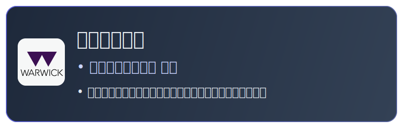
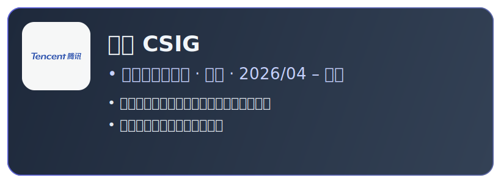
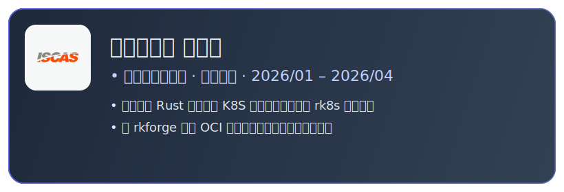
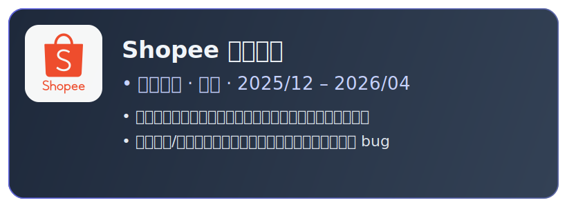
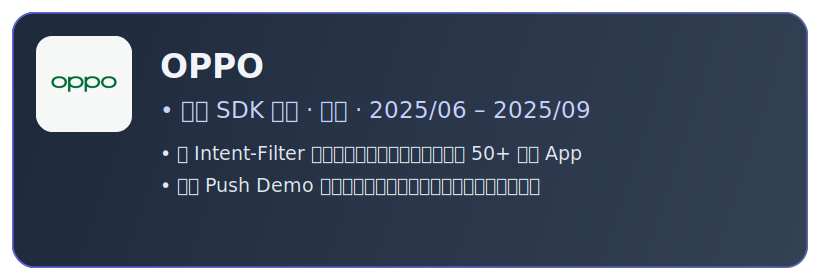
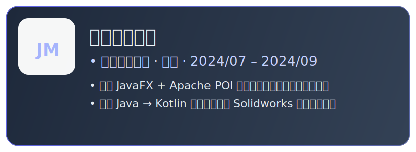

<!-- 🌐 语言切换 -->

  <a href="./README.md">English</a> | <a href="./README_CN.md">简体中文</a>

<!-- ═══════════════════════════════════════════════════ -->
<!-- HERO -->
<!-- ═══════════════════════════════════════════════════ -->

<h1>✦ Yuanzhi Liu ✦</h1>

 

<!-- 快捷链接 -->

&nbsp;

<!-- ═══════════════════════════════════════════════════ -->
<!-- 学历卡片 -->
<!-- ═══════════════════════════════════════════════════ -->

<h2 align="center">🎓 教育经历</h2>

<table>
  <tr>
    <td align="center" valign="top" width="50%">
      
    </td>
    <td align="center" valign="top" width="50%">
      
    </td>
  </tr>
</table>

<!-- ═══════════════════════════════════════════════════ -->
<!-- 实习经验 -->
<!-- ═══════════════════════════════════════════════════ -->

## 💼 实习经验

  
    
  
    
  
    
  
    
  

<!-- ═══════════════════════════════════════════════════ -->
<!-- 精选项目 -->
<!-- ═══════════════════════════════════════════════════ -->

## 🚀 Mod项目

<table>
<tr>
<td width="50%" valign="top">

### Dynamic Shader

> 基于 HLSL 开发的自定义 Shader，为《星露谷物语》实现 **HD2D 风格** 渲染。

- 通过 **Harmony** 拦截游戏渲染管线，注入自定义 Shader 模拟 3D 光照系统
- **GPU 加速**阴影渲染 + 双缓冲阴影收集队列，实现低开销全局阴影。LUT减少15M次数学计算，分离卷积核优化高斯模糊，双Dict纹理分类减少90% drawcall
- **自定义顶点/像素着色器**：实现3D投影模拟、接触硬化阴影、环境光色相偏移、移轴效果

`HLSL` `GPU Batching` `Harmony` `Shader`

</td>
<td width="50%" valign="top">

### BetterBuildingUpgrades

> 使用 Harmony + SMAPI 框架扩展《星露谷物语》核心方法的游戏模组。

- 通过**反射注入**代码，重写并扩展游戏核心方法
- 解决**多人模式下的数据一致性**问题
- 优化大范围自动化逻辑的计算开销，确保游戏帧率稳定

`C#` `SMAPI` `Harmony`

</td>
</tr>
</table>

 

<!-- ═══════════════════════════════════════════════════ -->
<!-- 技术栈 -->
<!-- ═══════════════════════════════════════════════════ -->

## 🛠️ 技术栈

**工作开发**

**个人项目**

**探索中**

> 其他技能: `HLSL` `JavaFX` `LangGraph` `MCP`

 

<!-- ═══════════════════════════════════════════════════ -->
<!-- 社区与活动 -->
<!-- ═══════════════════════════════════════════════════ -->

## 📜 其他活动

- 🎮 腾讯 IEG 开局一课 游戏客户端（UE）方向证书
- 🌐 通过 Localizor 为独立游戏 *Big Ambitions* 和 *Supermarket Simulator* 提供中文翻译
- ✍️ 在《小黑盒》发布 Mod 开发文章，累计 **61,900+** 阅读量
- 🌿 在 Warwick Nature Conservation 担任志愿者，参与环境保护超过 **30 小时**

 

<!-- ═══════════════════════════════════════════════════ -->
<!-- FOOTER -->
<!-- ═══════════════════════════════════════════════════ -->

<!-- ═══════════════════════════════════════════════════ -->
<!-- GITHUB 数据 -->
<!-- ═══════════════════════════════════════════════════ -->

<h2 align="center">📊 GitHub 数据</h2>

&nbsp;

<!-- 奖杯 -->

<!-- 活动图 -->

 

<!-- 访问量 -->

