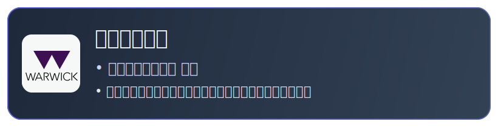
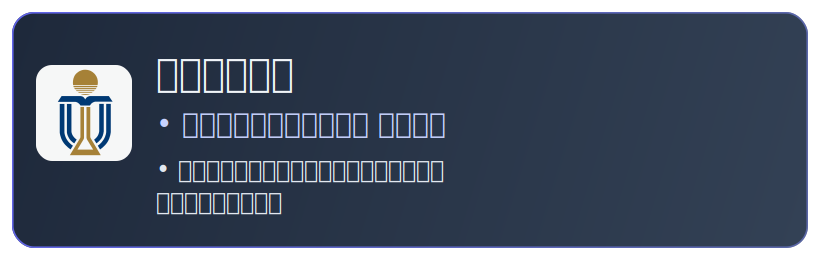

<!-- 🌐 语言切换 -->

  <a href="./README.md">English</a> | <a href="./README.zh-CN.md">简体中文</a>

<!-- ═══════════════════════════════════════════════════ -->
<!-- HERO -->
<!-- ═══════════════════════════════════════════════════ -->

<h1>✦ Yuanzhi Liu ✦</h1>

 

<!-- 快捷链接 -->

&nbsp;

<!-- ═══════════════════════════════════════════════════ -->
<!-- 学历卡片 -->
<!-- ═══════════════════════════════════════════════════ -->

<h2 align="center">🎓 教育经历</h2>

<table>
  <tr>
    <td align="center" valign="top" width="50%">
      
    </td>
    <td align="center" valign="top" width="50%">
      
    </td>
  </tr>
</table>

 

<!-- ═══════════════════════════════════════════════════ -->
<!-- 实习经验 -->
<!-- ═══════════════════════════════════════════════════ -->

## 💼 实习经验

<b> &nbsp;数字银行后端开发 &nbsp;·&nbsp; Shopee &nbsp;·&nbsp; 深圳 &nbsp;·&nbsp; 2025/12 – 至今</b>

- 开发**异步校验流水线**，实现每日借贷余额、贷款状态和流水的金额校验——多表关联分批过滤，按产品/状态/金额类型路由到对应校验器并上报监测平台。
- 开发流水线节点，实现员工贷产品变更和 **Park 资金流水发生额生成**，通过 LA & LC 联调完成全链路测试。

 

<b> &nbsp;分布式系统开发 &nbsp;·&nbsp; 中国科学院 软件研究所 &nbsp;·&nbsp; 远程办公 &nbsp;·&nbsp; 2026/01 – 至今</b>

- 参与高性能分布式对象储存系统 **RustFS** 的功能开发与维护。

 

<b> &nbsp;OpushSDK 推送系统 &nbsp;·&nbsp; OPPO &nbsp;·&nbsp; 深圳 &nbsp;·&nbsp; 2025/06 – 2025/09</b>

- 采用 **Intent-Filter 扫描**重构 SDK 自动化检测工具，解决第三方二次开发导致的组件名匹配失效问题，覆盖 **50+ 头部 App** 和系统级应用。
- 修复 Push Demo 多线程并发请求堆积问题，简化/封装调试接口，加快三方开发者接入速度。

 

<b>&nbsp;工业软件开发 &nbsp;·&nbsp; 金机智能装备 &nbsp;·&nbsp; 深圳 &nbsp;·&nbsp; 2024/07 – 2024/09</b>

- 基于 JavaFX 集成 **Apache POI**，开发图纸文件自动分类、打包和检索工具——打包流程缩减 **80%**。
- 主导 Java → Kotlin 迁移（5k → 3.8k 行），优化 IO 操作空安全处理。
- 使用 **C++ 开发 Solidworks 插件**，用于检测图纸打孔情况。

 

<!-- ═══════════════════════════════════════════════════ -->
<!-- 精选项目 -->
<!-- ═══════════════════════════════════════════════════ -->

## 🚀 Mod项目

<table>
<tr>
<td width="50%" valign="top">

### Dynamic Shader

> 基于 HLSL 开发的自定义 Shader，为《星露谷物语》实现 **HD2D 风格** 渲染。

- 通过 **Harmony** 拦截游戏渲染管线，注入自定义 Shader 模拟 3D 光照系统
- **GPU 加速**阴影渲染 + 双缓冲阴影收集队列，实现低开销全局阴影
- 自定义顶点/像素着色器：伪 3D 投影、接触硬化阴影、环境光色相偏移
- **Dual Kawase** 模糊 + 降采样；双 Dict 纹理分类减少约 70% draw call

`HLSL` `GPU Batching` `Harmony` `Shader`

</td>
<td width="50%" valign="top">

### BetterBuildingUpgrades

> 使用 Harmony + SMAPI 框架扩展《星露谷物语》核心方法的游戏模组。

- 通过**反射注入**代码，重写并扩展游戏核心方法
- 解决**多人模式下的数据一致性**问题
- 优化大范围自动化逻辑的计算开销，确保游戏帧率稳定

`C#` `SMAPI` `Harmony`

</td>
</tr>
</table>

 

<!-- ═══════════════════════════════════════════════════ -->
<!-- 技术栈 -->
<!-- ═══════════════════════════════════════════════════ -->

## 🛠️ 技术栈

**核心 — 每天用于生产环境**

**生产级 — 在实际项目中使用**

**探索中 — 学习 & 个人项目**

> 其他技能: `HLSL` `JavaFX` `LangGraph` `MCP`

**自然语言** &nbsp;

 

<!-- ═══════════════════════════════════════════════════ -->
<!-- 社区与活动 -->
<!-- ═══════════════════════════════════════════════════ -->

## 📜 其他活动

- 🎮 腾讯 IEG 开局一课 游戏客户端（UE）方向证书
- 🌐 通过 Localizor 为独立游戏 *Big Ambitions* 和 *Supermarket Simulator* 提供中文翻译
- ✍️ 在《小黑盒》发布 Mod 开发文章，累计 **61,900+** 阅读量
- 🌿 在 Warwick Nature Conservation 担任志愿者，参与环境保护超过 **30 小时**

 

<!-- ═══════════════════════════════════════════════════ -->
<!-- FOOTER -->
<!-- ═══════════════════════════════════════════════════ -->

<!-- ═══════════════════════════════════════════════════ -->
<!-- GITHUB 数据 -->
<!-- ═══════════════════════════════════════════════════ -->

<h2 align="center">📊 GitHub 数据</h2>

&nbsp;

<!-- 奖杯 -->

<!-- 活动图 -->

 

<!-- 访问量 -->

